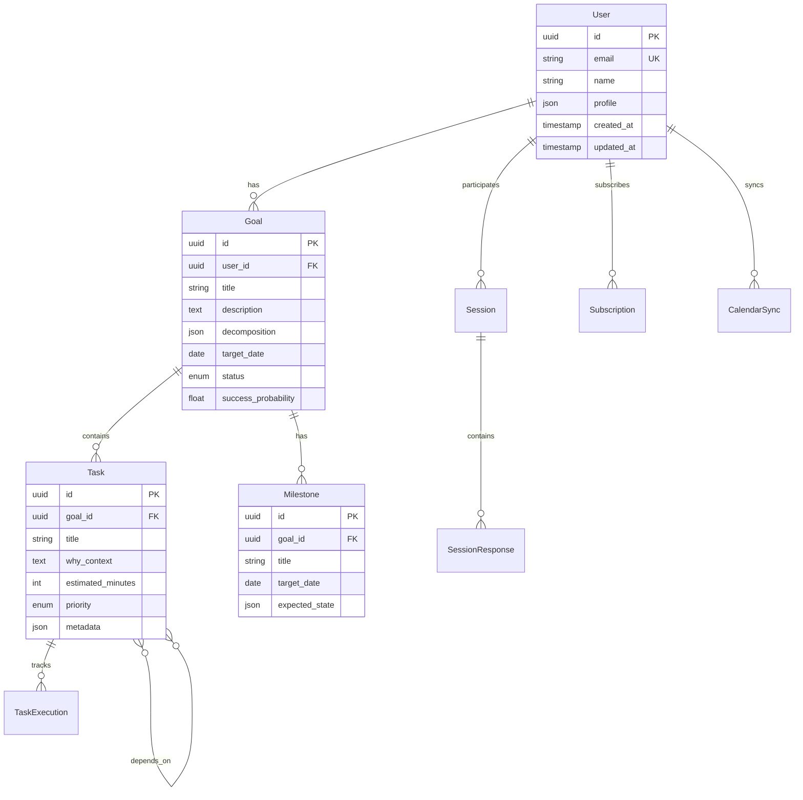

# プロダクト要件定義書（PRD）- ライフオーケストレーション MVP v1.0

## 1. エグゼクティブサマリー

### プロダクトの一文説明

理想の人生から逆算して必要なアクション（学習・実践・アウトプット）を特定し、カレンダーの空き時間に自動配置するAIコーチ・秘書サービス。

### MVP v1.0の具体的な成功指標

- **初期ユーザー数**: 1,000人（3ヶ月以内）
- **有料転換率**: 20%（フリーミアムモデル）
- **月額収益**: 30万円（200人 × 1,500円）
- **継続率**: 6ヶ月後60%以上
- **NPS**: 50以上

### マイルストーン

1. **UIモック作成フェーズ**
    - 全画面のワイヤーフレーム作成
    - インタラクティブプロトタイプ構築
    - ユーザーフィードバック収集
2. **UX単位での機能開発フェーズ**
    - AIヒアリングセッション機能（フロントエンド先行）
    - 目標分解・計画生成機能
    - 進捗可視化ダッシュボード
    - カレンダー統合機能
3. **基盤機能開発フェーズ**
    - ユーザー認証・管理
    - 課金システム統合
    - 本番環境構築・デプロイ

## 2. 技術アーキテクチャ

### システム構成図

```
┌─────────────────────────────────────────────────────────────┐
│                        Frontend (Next.js)                     │
│  ┌─────────────┐  ┌─────────────┐  ┌─────────────┐        │
│  │   React     │  │  TypeScript │  │  Tailwind   │        │
│  │ Components  │  │    Logic    │  │     CSS     │        │
│  └─────────────┘  └─────────────┘  └─────────────┘        │
└────────────────────────┬────────────────────────────────────┘
                         │ API Calls (REST/GraphQL)
┌────────────────────────┴────────────────────────────────────┐
│                    Backend (Node.js/Express)                  │
│  ┌─────────────┐  ┌─────────────┐  ┌─────────────┐        │
│  │     API     │  │   Business  │  │    Auth     │        │
│  │   Routes    │  │    Logic    │  │ Middleware  │        │
│  └─────────────┘  └─────────────┘  └─────────────┘        │
└────────────────────────┬────────────────────────────────────┘
                         │
┌────────────────────────┴────────────────────────────────────┐
│                    External Services                          │
│  ┌─────────────┐  ┌─────────────┐  ┌─────────────┐        │
│  │  OpenAI API │  │Google Calendar│ │   Stripe    │        │
│  │    (LLM)    │  │     API      │ │   Payment   │        │
│  └─────────────┘  └─────────────┘  └─────────────┘        │
└─────────────────────────────────────────────────────────────┘
                         │
┌────────────────────────┴────────────────────────────────────┐
│                  Database (PostgreSQL)                        │
│  ┌─────────────┐  ┌─────────────┐  ┌─────────────┐        │
│  │    Users    │  │    Goals    │  │    Tasks    │        │
│  │   Tables    │  │   Tables    │  │   Tables    │        │
│  └─────────────┘  └─────────────┘  └─────────────┘        │
└─────────────────────────────────────────────────────────────┘

```

### 技術スタック選定理由

### フロントエンド

- **Next.js 14**: App RouterによるサーバーコンポーネントでLLM開発と相性が良い
- **TypeScript**: 型安全性により開発時のエラーを削減
- **Tailwind CSS**: ユーティリティファーストでLLMが理解しやすい
- **Shadcn/ui**: 再利用可能なコンポーネントライブラリ
- **React Query (TanStack Query)**: サーバー状態管理の標準化

### バックエンド

- **Node.js + Express**: シンプルで拡張性の高いAPI構築
- **Prisma ORM**: 型安全なデータベースアクセス
- **Zod**: スキーマバリデーション

### データベース

- **PostgreSQL**: ACID準拠、JSON型サポート、将来の拡張性

### 外部サービス

- **OpenAI API**: GPT-4による高度な目標分解
- **Google Calendar API**: カレンダー統合
- **Stripe**: 課金処理
- **Vercel**: ホスティング（サーバーレス対応）

### データフロー図

```
User Input → Frontend Validation → API Gateway
                                        ↓
                              Authentication Check
                                        ↓
                              Business Logic Layer
                                    ↙     ↘
                        LLM Processing    Calendar Sync
                              ↘     ↙
                           Database Update
                                 ↓
                           Response to User

```

### セキュリティ要件

- JWT認証による API保護
- HTTPS通信の強制
- SQLインジェクション対策（Prisma使用）
- XSS対策（React自動エスケープ）
- CSRF対策（SameSite Cookie）
- レート制限（1分あたり60リクエスト）

## 3. 機能仕様

### F1: AIヒアリングセッション機能

**機能ID**: F1-AI-HEARING

**完了条件**:

- 20分のガイド付き対話フローが完成
- ユーザーの回答から目標と価値観を抽出できる
- セッション結果がデータベースに保存される

**入力/出力仕様**:

```tsx
// 入力
interface HearingSessionInput {
  userId: string;
  sessionType: 'initial' | 'periodic';
  responses: {
    questionId: string;
    answer: string;
    timestamp: Date;
  }[];
}

// 出力
interface HearingSessionOutput {
  sessionId: string;
  extractedGoals: Goal[];
  userProfile: {
    values: string[];
    currentAssets: AssetAnalysis;
    preferences: UserPreferences;
  };
}

```

**エラーケース**:

- セッション中断: 部分保存して再開可能
- LLM応答エラー: リトライ機構（3回まで）
- タイムアウト: 30秒でユーザーに通知

**パフォーマンス要件**:

- LLM応答時間: 5秒以内
- 全体セッション時間: 20分以内

### F2: LLM駆動型目標分解エンジン

**機能ID**: F2-GOAL-DECOMPOSITION

**完了条件**:

- 抽象的な目標を実行可能なタスクに分解
- 各タスクに「なぜ」の文脈を付与
- 分解結果の承認・編集機能

**入力/出力仕様**:

```tsx
interface GoalDecompositionInput {
  goalId: string;
  goalDescription: string;
  timeframe: number; // months
  userContext: UserContext;
}

interface GoalDecompositionOutput {
  decomposedTasks: Task[];
  milestones: Milestone[];
  dependencies: TaskDependency[];
  successProbability: number;
}

```

### F3: 自動計画生成・更新システム

**機能ID**: F3-AUTO-PLANNING

**完了条件**:

- ヒアリング結果から実行可能な計画を自動生成
- 定期的な計画の自動更新機能
- 変更理由の説明表示

### F4: 目標に対するユーザー現状分析システム

**機能ID**: F4-ASSET-ANALYSIS

**完了条件**:

- 3つのアセット（人的・経済・社会資本）の評価
- ギャップ分析と改善提案
- 視覚的なレーダーチャート表示

### F5: 確信度の高いプロセス設計エンジン

**機能ID**: F5-PROCESS-DESIGN

**完了条件**:

- 各ステップの成功確率表示
- 類似ケースの参照機能
- リスク要因の特定と対策提案

### F6: マイルストーン自動設定機能

**機能ID**: F6-MILESTONE-SETTING

**完了条件**:

- 長期目標を3-5個の中間目標に分割
- 各マイルストーンでの変化予測表示
- タイムライン上での視覚化

### F7: 進捗モニタリングシステム

**機能ID**: F7-PROGRESS-MONITORING

**完了条件**:

- 日/週/月単位の進捗追跡
- 負荷レベルの可視化
- 異常検知アラート機能

### F8: ペース調整・予測機能

**機能ID**: F8-PACE-ADJUSTMENT

**完了条件**:

- 目標達成日の動的予測
- ペース調整スライダー
- 燃え尽きリスクの警告表示

### F9: 進捗可視化ダッシュボード

**機能ID**: F9-PROGRESS-DASHBOARD

**完了条件**:

- 年/月/週/日の切り替えビュー
- GitHubスタイルのヒートマップ
- カスタマイズ可能なウィジェット

### F10: 意味づけフィードバックシステム

**機能ID**: F10-FEEDBACK-SYSTEM

**完了条件**:

- タスク完了時のアニメーション
- 目標貢献度の可視化
- SNSシェア機能

### F11: カレンダー統合・自動配置

**機能ID**: F11-CALENDAR-INTEGRATION

**完了条件**:

- Google Calendar OAuth認証
- 空き時間の自動検出
- ドラッグ&ドロップでの調整

### F14: 統合ワークフローUI

**機能ID**: F14-UNIFIED-UI

**完了条件**:

- レスポンシブデザイン対応
- 逆L字型レイアウト実装
- PWA対応

## 4. データモデル

### ERD（Entity Relationship Diagram）



### 詳細スキーマ

```sql
-- Users table
CREATE TABLE users (
    id UUID PRIMARY KEY DEFAULT gen_random_uuid(),
    email VARCHAR(255) UNIQUE NOT NULL,
    name VARCHAR(255) NOT NULL,
    profile JSONB DEFAULT '{}',
    created_at TIMESTAMP DEFAULT CURRENT_TIMESTAMP,
    updated_at TIMESTAMP DEFAULT CURRENT_TIMESTAMP
);

-- Goals table
CREATE TABLE goals (
    id UUID PRIMARY KEY DEFAULT gen_random_uuid(),
    user_id UUID REFERENCES users(id) ON DELETE CASCADE,
    title VARCHAR(500) NOT NULL,
    description TEXT,
    decomposition JSONB,
    target_date DATE,
    status VARCHAR(50) DEFAULT 'active',
    success_probability DECIMAL(3,2),
    created_at TIMESTAMP DEFAULT CURRENT_TIMESTAMP
);

-- Indexes
CREATE INDEX idx_goals_user_id ON goals(user_id);
CREATE INDEX idx_goals_status ON goals(status);
CREATE INDEX idx_tasks_goal_id ON tasks(goal_id);

```

### データ保持期間

- アクティブデータ: 無期限
- 削除済みデータ: 30日間（復元可能期間）
- ログデータ: 90日間
- 分析用集計データ: 2年間

## 5. API仕様

### OpenAPI 3.0形式

```yaml
openapi: 3.0.0
info:
  title: Life Orchestration API
  version: 1.0.0

paths:
  /api/v1/auth/login:
    post:
      summary: User login
      requestBody:
        required: true
        content:
          application/json:
            schema:
              type: object
              properties:
                email:
                  type: string
                  format: email
                password:
                  type: string
      responses:
        200:
          description: Login successful
          content:
            application/json:
              schema:
                type: object
                properties:
                  token:
                    type: string
                  user:
                    $ref: '#/components/schemas/User'

  /api/v1/goals:
    get:
      summary: Get user goals
      security:
        - bearerAuth: []
      parameters:
        - name: status
          in: query
          schema:
            type: string
            enum: [active, completed, archived]
      responses:
        200:
          description: Goals retrieved
          content:
            application/json:
              schema:
                type: array
                items:
                  $ref: '#/components/schemas/Goal'

  /api/v1/hearing-session:
    post:
      summary: Start AI hearing session
      security:
        - bearerAuth: []
      responses:
        200:
          description: Session started
          content:
            application/json:
              schema:
                type: object
                properties:
                  sessionId:
                    type: string
                  firstQuestion:
                    type: string

components:
  securitySchemes:
    bearerAuth:
      type: http
      scheme: bearer
      bearerFormat: JWT

```

### 認証・認可フロー

1. Email/Password認証 → JWT発行
2. JWTをAuthorizationヘッダーに含める
3. リフレッシュトークンで自動更新

### レート制限

- 認証なし: 10リクエスト/分
- 認証あり: 60リクエスト/分
- LLM API: 10リクエスト/分

### エラーレスポンス形式

```json
{
  "error": {
    "code": "VALIDATION_ERROR",
    "message": "Invalid input data",
    "details": {
      "field": "email",
      "issue": "Invalid email format"
    }
  },
  "timestamp": "2024-01-15T10:30:00Z",
  "path": "/api/v1/auth/login"
}

```

## 6. UI/UX詳細仕様

### 画面遷移図

```
Landing Page
    ↓
Sign Up/Login
    ↓
Initial Hearing Session ← → Skip
    ↓
Dashboard
    ├→ Goals Management
    ├→ Calendar View
    ├→ Progress Analytics
    └→ Settings
        └→ Subscription

```

### 各画面のワイヤーフレーム

### ダッシュボード画面

```
┌─────┬─────────────────────────────────┬─────┐
│Logo │  ライフダッシュボード          │ 👤  │
├─────┼─────────────────────────────────┼─────┤
│ 🏠  │  年間進捗 ████████░░░░ 67%    │今日 │
│ 🎯  │                                 │の   │
│ 📅  │  [進捗ヒートマップ]            │タスク│
│ 📊  │  □□■■■■■□□■■■■■□□       │     │
│ ⚙️  │  □■■■■■■□□■■■■■□□       │• 学習│
│     │                                 │• 副業│
│     │  主要目標:                      │• 運動│
│     │  • 副業収入  ███████░░ 70%    │     │
│     │  • スキル向上 █████░░░░ 50%    │     │
└─────┴─────────────────────────────────┴─────┘

```

### コンポーネント階層

```
App
├── Layout
│   ├── Header
│   ├── Sidebar
│   └── MainContent
├── Pages
│   ├── Dashboard
│   │   ├── ProgressHeatmap
│   │   ├── GoalProgress
│   │   └── TodayTasks
│   ├── HearingSession
│   │   ├── QuestionFlow
│   │   └── ProgressIndicator
│   └── Calendar
│       ├── WeekView
│       └── TaskDragDrop
└── Components
    ├── Button
    ├── Card
    └── Modal

```

### 状態管理仕様

```tsx
// Global State (Zustand)
interface AppState {
  user: User | null;
  goals: Goal[];
  tasks: Task[];
  currentSession: Session | null;
}

// Server State (React Query)
const useGoals = () => useQuery(['goals'], fetchGoals);
const useCreateGoal = () => useMutation(createGoal);

```

### レスポンシブデザイン要件

- モバイル（< 768px）: 単一カラムレイアウト
- タブレット（768px - 1024px）: 2カラムレイアウト
- デスクトップ（> 1024px）: 3カラムレイアウト

## 7. 実装タスクリスト概要

### タスク一覧

1. **プロジェクト初期設定**
    - Next.jsプロジェクト作成
    - 基本的な依存関係インストール
    - ESLint/Prettier設定
    - 見積もり: 2時間
2. **UIモック作成**
    - 全画面のワイヤーフレーム
    - インタラクティブプロトタイプ
    - 見積もり: 8時間
3. **認証システム実装**
    - JWT認証基盤
    - ログイン/サインアップ画面
    - 見積もり: 6時間
4. **AIヒアリングセッション機能**
    - フロントエンド実装
    - OpenAI API統合
    - 見積もり: 12時間
5. **目標分解エンジン**
    - LLMプロンプト設計
    - 分解ロジック実装
    - 見積もり: 10時間
6. **データベース構築**
    - PostgreSQL設定
    - Prismaスキーマ定義
    - 見積もり: 4時間
7. **進捗ダッシュボード**
    - コンポーネント実装
    - データ可視化
    - 見積もり: 8時間
8. **カレンダー統合**
    - Google Calendar OAuth
    - 同期ロジック
    - 見積もり: 8時間
9. **課金システム**
    - Stripe統合
    - サブスクリプション管理
    - 見積もり: 6時間
10. **デプロイメント**
    - Vercel設定
    - 環境変数管理
    - 見積もり: 4時間

### タスク間の依存関係

- 認証システム → 他のすべての機能
- データベース → API実装
- UIモック → 各画面実装

### 並列実行可能なタスク

- UIモック作成とデータベース構築
- 各機能のフロントエンドとバックエンド

## 8. テスト戦略

### ユニットテストカバレッジ目標

- ビジネスロジック: 80%以上
- UIコンポーネント: 60%以上
- API エンドポイント: 90%以上

### 統合テストシナリオ

```tsx
// 例: ヒアリングセッション統合テスト
describe('Hearing Session Integration', () => {
  test('Complete hearing session flow', async () => {
    // 1. セッション開始
    const session = await startHearingSession(userId);

    // 2. 質問への回答
    await answerQuestion(session.id, 'q1', 'answer1');

    // 3. 目標生成確認
    const goals = await getGeneratedGoals(session.id);
    expect(goals).toHaveLength(greaterThan(0));
  });
});

```

### E2Eテストケース

1. 新規ユーザー登録 → ヒアリングセッション → 目標設定
2. 既存ユーザーログイン → タスク完了 → 進捗確認
3. カレンダー同期 → タスク自動配置 → リスケジュール

### パフォーマンステスト基準

- ページロード時間: 3秒以内
- API レスポンス: 95%が1秒以内
- LLM処理: 5秒以内

## 9. デプロイメント仕様

### CI/CDパイプライン設計

```yaml
# .github/workflows/deploy.yml
name: Deploy to Production

on:
  push:
    branches: [main]

jobs:
  test:
    runs-on: ubuntu-latest
    steps:
      - uses: actions/checkout@v3
      - name: Run tests
        run: npm test

  deploy:
    needs: test
    runs-on: ubuntu-latest
    steps:
      - name: Deploy to Vercel
        uses: amondnet/vercel-action@v20

```

### 環境構成

| 環境 | 用途 | URL |
| --- | --- | --- |
| 開発 | ローカル開発 | http://localhost:300x
サーバ起動時に空いているポートを使う |
| ステージング | 受け入れテスト | https://staging.life-orchestration.app |
| 本番 | 実運用 | https://life-orchestration.app |

### ロールバック手順

1. Vercelダッシュボードから前のデプロイメントを選択
2. "Promote to Production"をクリック
3. データベースマイグレーションが必要な場合は手動でロールバック

### 監視・アラート設定

- **Vercel Analytics**: ページビュー、エラー率
- **Sentry**: エラートラッキング
- **Uptime Robot**: 死活監視（5分間隔）
- **PostgreSQL**: スロークエリアラート

## 10. 運用考慮事項

### ログ設計

```tsx
// ログレベルと形式
enum LogLevel {
  DEBUG = 'debug',
  INFO = 'info',
  WARN = 'warn',
  ERROR = 'error'
}

interface LogEntry {
  timestamp: ISO8601String;
  level: LogLevel;
  userId?: string;
  action: string;
  metadata: Record<string, any>;
}

```

### メトリクス収集

- **ビジネスメトリクス**
    - DAU/MAU
    - 有料転換率
    - タスク完了率
    - セッション継続率
- **技術メトリクス**
    - API応答時間
    - エラー率
    - データベース接続数
    - LLM API使用量

### バックアップ戦略

- **データベース**: 日次自動バックアップ（30日保持）
- **ユーザーアップロードファイル**: S3へのリアルタイム同期
- **設定ファイル**: Gitリポジトリで管理

### 障害対応フロー

1. **検知**: 監視アラート受信
2. **評価**: 影響範囲の特定
3. **対応**:
    - 軽微: ホットフィックス
    - 重大: ロールバック
4. **報告**: ステータスページ更新
5. **事後対応**: ポストモーテム作成

## 付録: 主要な実装パターン

### LLMプロンプトテンプレート

```tsx
const goalDecompositionPrompt = `
あなたは人生設計の専門家です。以下の目標を実現可能なタスクに分解してください。

目標: {goalDescription}
期限: {timeframe}ヶ月
現在のスキル: {currentSkills}

以下の形式でJSONを返してください:
{
  "tasks": [
    {
      "title": "タスク名",
      "why": "このタスクが必要な理由",
      "estimatedHours": 10,
      "dependencies": []
    }
  ],
  "milestones": [
    {
      "title": "マイルストーン名",
      "targetMonth": 3,
      "expectedOutcome": "期待される成果"
    }
  ]
}
`;

```

### React Queryパターン

```tsx
// カスタムフック例
export const useGoals = () => {
  return useQuery({
    queryKey: ['goals'],
    queryFn: fetchGoals,
    staleTime: 5 * 60 * 1000, // 5分
  });
};

export const useCreateGoal = () => {
  const queryClient = useQueryClient();

  return useMutation({
    mutationFn: createGoal,
    onSuccess: () => {
      queryClient.invalidateQueries(['goals']);
    },
  });
};

```

本PRDは、MVP v1.0の実装に必要なすべての技術仕様を網羅しています。LLMはこの文書を参照することで、開発タスクの生成から実装、デプロイまでを完遂することができます。